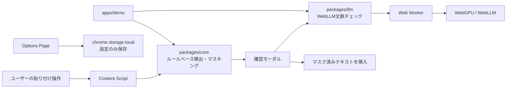

# 貼るまえ

**AIに貼る前に、消し忘れを見つける。**

「貼るまえ」は、ChatGPT・Claude・Gemini・PerplexityなどのAIサービスや外部フォームに文章を貼り付ける前に、個人情報・秘密情報・APIキー・社外秘っぽい内容をブラウザ内で検出するChrome拡張です。

単なるAIチャットではなく、AIに送る前の「最後の確認レイヤー」として動作します。

## 作った理由

生成AIに文章を貼り付ける作業は、メール作成、議事録整理、要約、翻訳、調査などの日常業務に入り込んでいます。一方で、本文の中にメールアドレス、電話番号、APIキー、社内URL、顧客名、見積金額、契約前情報が混ざっていても、送信ボタンを押す直前まで気づきにくいことがあります。

「貼るまえ」は、送信前にもう一度立ち止まるための補助ツールです。情報漏洩を完全に防ぐ製品ではなく、消し忘れに気づくきっかけを作ることを目的にしています。

## 解決したい課題

- AIに貼る文章へ個人情報や秘密情報が混ざりやすい
- APIキーやトークンは見落とすと影響が大きい
- 社外秘と明記されていない文脈リスクは正規表現だけでは拾いにくい
- バックエンドや外部LLM APIに本文を送る設計だと、確認ツール自体が新しいリスクになり得る
- 導入やランニングコストが重いと、個人開発や小さなチームでは使い続けにくい

## ChatGPTの下位互換ではありません

「貼るまえ」は、文章を生成するAIチャットではありません。ChatGPTなどに貼る前に動く安全レイヤーです。

ルールベース検出で確定的な情報を見つけ、WebLLMで文脈上の注意候補を補助的に確認します。最終的に送信するかどうかはユーザーが判断します。

## 主な機能

- 対象サイトでのpasteイベント検知
- メール、電話番号、JWT、AWS Access Key風文字列、GitHub token風文字列、秘密鍵、`.env`形式の秘密情報などの検出
- Basic認証URL、URL、IPv4、金額、社外秘・注意語、社内URL風文字列の検出
- 日付、郵便番号、長いID風文字列の低リスク検出
- Luhnチェックによるクレジットカード風番号の検出
- 重複範囲の優先順位処理
- プレースホルダー連番付きのマスキング
- Shadow DOMベースの確認モーダル
- `textarea`、text/search input、`contenteditable`へのカーソル位置挿入
- Options Pageで対象サイト、検出ルール、WebLLM設定を変更
- Webデモサイトで拡張なしに検出とマスキングを体験

## 使用イメージ

1. ChatGPTなどの対象サイトで文章を貼り付ける
2. 危険情報が見つからなければ通常通り貼り付け
3. 危険情報が見つかると確認モーダルを表示
4. ユーザーが「マスクして貼る」「AI文脈チェックも実行」「そのまま貼る」「キャンセル」から選ぶ
5. マスクして貼る場合は、現在のカーソル位置にマスキング後テキストを挿入

## WebLLMを使っている理由

メールアドレスやAPIキーのような確定的な情報は、正規表現やルールで検出できます。一方で、顧客名、案件名、契約前情報、採用・給与・法務の文脈などは、単純なパターンだけでは検出しづらいことがあります。

そこでWebLLMを使い、ユーザーのブラウザ内で文脈リスク候補を確認します。外部LLM APIは使いません。ランニングコストがかからない構成にしつつ、文脈チェックを補助できるようにしています。

## WebLLMでやっていること

- 正規表現では拾いにくい文脈リスクの検出
- 顧客名候補、人名候補、会社名候補、案件名・プロジェクト名候補の検出
- 契約、見積、給与、採用、法務、社内事情などの注意候補の検出
- 検出理由の日本語説明
- マスキング候補の提案

## WebLLMでやっていないこと

- メールアドレス検出の主役にすること
- APIキー検出の主役にすること
- 電話番号検出の主役にすること
- 最終的な安全判定を断言すること
- 文章全体の要約を主目的にすること

## 技術スタック

- pnpm workspace
- TypeScript
- React
- WXT
- Vite
- Tailwind CSS
- Vitest
- Playwright
- Chrome Extension Manifest V3
- `@mlc-ai/web-llm`
- Web Worker
- WebGPU
- `chrome.storage.local`

## アーキテクチャ図



## ディレクトリ構成

```text
harumae/
  apps/
    extension/  Chrome拡張本体
    demo/       Webデモサイト
  packages/
    core/       ルールベース検出、マスキング、型定義
    llm/        WebLLM文脈チェック、Worker、プロンプト、JSONパース
  AGENTS.md
  README.md
  package.json
  pnpm-workspace.yaml
```

## セットアップ

```bash
pnpm install
```

PlaywrightのE2Eを実行する場合:

```bash
pnpm exec playwright install chromium
```

## 開発コマンド

```bash
pnpm dev
pnpm dev:extension
pnpm dev:demo
pnpm build
pnpm build:extension
pnpm build:demo
pnpm test
pnpm test:core
pnpm test:llm
pnpm test:e2e
pnpm lint
pnpm typecheck
```

`pnpm lint`は現時点では`pnpm typecheck`の別名です。初期実装ではlint環境よりも型チェックとテストを優先しています。

## Chrome拡張の読み込み方法

1. `pnpm build:extension`を実行
2. Chromeで`chrome://extensions`を開く
3. デベロッパーモードを有効にする
4. 「パッケージ化されていない拡張機能を読み込む」を選ぶ
5. `apps/extension/.output/chrome-mv3`を選択

## デモサイトの起動方法

```bash
pnpm dev:demo
```

起動後、表示されたローカルURLをブラウザで開きます。ビルド確認だけなら次を実行します。

```bash
pnpm build:demo
```

## 検出対象

高リスク:

- メールアドレス
- 日本の電話番号
- JWT
- AWS Access Key風文字列
- GitHub token風文字列
- 秘密鍵
- `.env`形式の秘密情報
- Basic認証情報を含むURL
- クレジットカード風番号

中リスク:

- URL
- IPv4アドレス
- 金額
- 社外秘・注意語を含む文
- 社内URLっぽいもの

低リスク:

- 日付
- 郵便番号
- 長いID風文字列

## プライバシー設計

- 貼り付け本文を永続保存しません
- placeholderMapも永続保存しません
- 設定のみ`chrome.storage.local`に保存します
- ユーザー本文を`console.log`で出力しません
- エラーにも本文を含めません
- WebLLMに渡す本文はブラウザ内処理です
- 外部LLM APIには本文を送りません
- Analyticsやトラッキングは入れていません
- 拡張機能の権限は対象AIサイトと`storage`に限定しています

## モデルファイル取得について

貼り付け本文は外部サーバーに送信されません。検出とAI文脈チェックはユーザーのブラウザ内で実行されます。

WebLLMの初回利用時には、ローカル推論用のモデルファイルを取得する場合があります。モデル取得後はブラウザキャッシュを利用します。あなた自身の推論サーバーや外部LLM APIは利用しません。

ただし、WebLLMのモデル配信元やブラウザキャッシュの挙動には第三者の配信基盤やブラウザ実装が関わる場合があります。この点は、完全に自己完結した配布物ではない制限として扱っています。

## セキュリティ上の注意

- 本ツールは情報漏洩を完全に防ぐものではありません
- 検出漏れや誤検出が発生する可能性があります
- 最終的に送信するかどうかはユーザーが判断してください
- WebLLMによる判定は補助的な候補提示です
- WebGPU非対応環境ではAI文脈チェックを利用できない場合があります
- モデルロードには時間がかかる場合があります

## 実装上の前提・制限

- 初期対象サイトは`chatgpt.com`、`chat.openai.com`、`claude.ai`、`gemini.google.com`、`www.perplexity.ai`です。
- 初期実装では`<all_urls>`を要求しません。
- password、email、tel、number、クレジットカード系と思われるinput、disabled、readonlyには介入しません。
- WebLLMのデフォルトモデルは`Llama-3.2-1B-Instruct-q4f16_1-MLC`です。
- WebLLM Workerは拡張では`llm-worker.js`として出力し、対象サイトに限定してweb accessible resourceにしています。
- WebLLMモデルIDはOptions Pageで変更できます。パッケージ側ではWebLLMのprebuilt model listを見て、指定モデルがない場合は利用可能な軽量モデルへフォールバックします。
- LLM候補の`surface`が入力文に存在する場合だけFindingへ変換します。
- 同じ`surface`が複数回出現した場合、初期実装ではすべての出現箇所を候補Findingに変換します。ユーザーが候補チェックを外せばマスク対象から外せます。
- confidenceが低い候補はパース時または変換時に除外します。
- デモサイトのAI文脈チェックはWebGPU対応ブラウザでの手動確認が必要です。E2Eでは実モデルロードを必須条件にしていません。
- 商用可能かつランニングコストがかからない構成を意識していますが、利用するWebLLMモデル自体のライセンスや配信条件は、採用モデルごとに確認が必要です。
- GitHubでのIssue作成、PR作成、マージは運用ルールとして追加しました。実際のGitHub remoteや認証が未設定の場合は、ローカルgit履歴まで整えたうえで次の手順を提示します。

## GitHubでの開発運用

このリポジトリはGitHubで管理する前提です。リポジトリは原則publicで作成・運用し、公開される前提で秘密情報、個人情報、実トークン、実APIキーを含めない方針にしています。

基本の流れ:

1. 作業内容をIssueにする
2. Issue番号に紐づくブランチを作る
3. 実装、テスト、ビルドを行う
4. PRを作成する
5. レビュー後にマージする

GitHub CLIが使える環境では、次のような運用を想定しています。

```bash
gh issue create
git switch -c feat/issue-number-topic
gh pr create
gh pr merge
```

## 今後追加したい機能

- 対象サイトの追加
- 組織ごとのカスタム検出ルール
- ルールごとの説明文の強化
- WebLLMモデル選択UIの拡張
- 手動確認用のサンプルシナリオ追加
- Chrome Web Store公開用のアイコンとスクリーンショット整備
- GitHub ActionsでのCI

## スクリーンショット掲載予定

- デモサイトの3カラム画面
- Chrome拡張の確認モーダル
- Options Page
- AI文脈チェック結果
