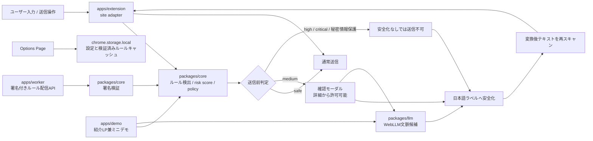

# AIまえチェック

**AIに送る前に、消し忘れを見つける。**

「AIまえチェック」は、ChatGPT / Claude / Gemini / Perplexity などのLLMサービスへ文章を貼る前・送る前に、個人情報・秘密情報・APIキー・社外秘っぽい内容をブラウザ内で検出し、安全化を促すChrome拡張です。

単なるAIチャットではなく、普段使っているLLMの入力欄の前に置く「送信前DLPレイヤー」を目指しています。サイドパネルや独自入力欄を主役にせず、対象サイトの通常入力体験をできるだけ保ったまま、送信前に小さく止まって確認できる設計です。

## 現在の位置づけ

**公開ステータス:** Chrome Web Storeで0.1.0を一般公開済みです。公開ページは <https://chrome.google.com/webstore/detail/idedmkfplfieijdcflcogkngplhkkecc> です。

このリポジトリには、すでに以下の基盤があります。

- pnpm workspaceによるmonorepo構成
- `packages/core` のルールベース検出・マスキング
- `packages/llm` のWebLLM文脈チェック基盤
- `apps/extension` のChrome拡張
- `apps/demo` の紹介LP兼ミニデモサイト
- Vitest / Playwrightのテスト基盤

現在は、初期実装の「貼り付け時チェック」に加えて、送信ボタン・Enter送信を捕捉する「送信前DLPレイヤー」の基礎実装まで進んでいます。デモサイトは拡張機能を入れる前に価値を試す補助体験であり、プロダクト本体はChrome拡張です。実装ロードマップは [DLP Roadmap Implementation Plan](./docs/superpowers/plans/2026-06-16-dlp-roadmap.md) に整理しています。

## 公開後の確認導線

Chrome Web Store公開後は、次の順番で確認できるようにしています。

1. 紹介LPで、AIまえチェックがChrome拡張を本体とする送信前DLPレイヤーであることを確認する
2. LPまたはREADMEからChrome Web Storeへ移動し、拡張機能を追加する
3. ミニデモで、ルール検出、AI文脈チェック、安全化対象選択、安全化後テキストの考え方を先に試す
4. 開発者向けには、`pnpm build:extension` 後に `apps/extension/.output/chrome-mv3` をChromeへ読み込む確認手順も残す

ミニデモは導入前の補助体験です。ポートフォリオとしては体験価値を説明する入口にしつつ、READMEとLPではChrome拡張がプロダクト本体であることと、Chrome Web Storeから追加できることを先に示します。

設計判断と技術構成を採用担当者・エンジニア向けにまとめたケーススタディは [docs/portfolio-case-study.md](docs/portfolio-case-study.md) にあります。

## 作った理由

生成AIに文章を送る作業は、メール作成、議事録整理、要約、翻訳、調査、コード相談などの日常業務に入り込んでいます。一方で、送ろうとしている文章には、メールアドレス、電話番号、APIキー、社内URL、顧客名、契約金額、採用・法務・給与などの注意情報が混ざりがちです。

「送信」ボタンを押す直前まで気づきにくい消し忘れを、ブラウザ内で補助的に見つける。それがAIまえチェックの目的です。

## 解決したい課題

- LLMへ送る文章に個人情報や秘密情報が混ざる
- APIキーやトークンは一度漏れると影響が大きい
- 「社外秘」と明記されていない文脈リスクは正規表現だけでは拾いにくい
- 自前サーバーや外部LLM APIへ本文を送る設計にすると、確認ツール自体が新しいリスクになる
- 個人開発でも継続できる、ランニングコストの低い構成にしたい

## ChatGPTの下位互換ではありません

AIまえチェックは文章を生成するAIチャットではありません。

ChatGPT / Claude / Gemini / Perplexity へ送る前に、送信内容を検出・安全化するための補助レイヤーです。最終的に送るかどうかはユーザーが判断します。AIまえチェックは「完全に安全」と断言せず、消し忘れに気づくための実用的な確認体験を目指します。

## 新方針

現在は、貼り付けイベントに加えて対象LLMサイトの送信操作も捕捉する方針で実装しています。

- 対象サイトは ChatGPT / Claude / Gemini / Perplexity
- サイドパネルや独自入力欄ではなく、通常の入力欄を使う
- 送信直前に確認モーダルを出す
- `medium` は詳細確認後に許可可能
- `high` / `critical` と秘密情報保護の対象は、安全化なしでは送信不可
- 安全化後の本文は `[メールアドレス]` や `[電話番号]` のような日本語ラベルへ置き換える
- テキスト系ファイル添付前チェックはMVPとして対応

## 主な機能

現在の実装:

- メールアドレス、電話番号、JWT、AWS Access Key風文字列、GitHub / Slack / Stripe / OpenAI / npm / OAuth token風文字列などの検出
- 秘密鍵、`.env`形式の秘密情報、Basic認証URL、Webhook URL、DATABASE_URL風接続文字列、クレジットカード風番号、マイナンバー風文字列の検出
- URL、IPv4、金額、社外秘・注意語、社内URL風文字列の検出
- 日付、郵便番号、長いID風文字列の低リスク検出
- 重複範囲を整理したマスキング
- WebLLMによるブラウザ内の文脈リスク候補チェック
- Chrome拡張を入れる前に試せる、紹介LP兼ミニデモ
- Chrome拡張のOptions Page

新方針で追加・刷新する機能:

- ChatGPT / Claude / Gemini / Perplexity のsite adapter
- 送信ボタンclick、Enter、Cmd+Enter / Ctrl+Enterの送信前インターセプト
- 秘密情報保護の対象判定
- risk score / policy判定
- カテゴリ単位の確認モーダル
- 日本語ラベルによる安全化
- WebLLMによる文脈リスク候補チェック
- 変換後テキストの再スキャン
- `.txt` / `.md` / `.csv` / `.json` / `.yaml` / `.env` / `.log` / code系ファイルの添付前チェック

## 使用イメージ

1. ユーザーはChatGPT / Claude / Gemini / Perplexityの通常入力欄に文章を入力する
2. AIまえチェックがブラウザ内で軽量検出し、必要な場合は送信前の確認モーダルを表示する
3. 貼り付け本文にルール検出対象、または契約・採用・未公開などの文脈チェック候補がある場合は確認モーダルを表示する
4. 文脈チェック候補では、貼り付け時は `AI文脈チェックも実行`、送信前は短い `AIチェック` ボタンを押した場合だけWebLLMを起動する
5. ユーザーが送信ボタンやEnterで送信しようとする
6. リスクがなければ通常どおり送信する
7. 注意情報がある場合は送信前に確認モーダルを表示する
8. ユーザーはカテゴリごとに安全化対象を確認する
9. 具体的な値を `[メールアドレス]` や `[電話番号]` などの日本語ラベルへ置き換えて安全化する
10. 安全化後のテキストを再スキャンし、秘密情報保護の対象が残っていない場合に送信する

## WebLLMを使っている理由

メールアドレスやAPIキーのような確定情報は、正規表現やルールベースで検出できます。一方で、顧客名、会社名、案件名、契約前情報、採用・給与・法務・金融などの文脈リスクは、単純な文字列パターンだけでは拾いにくいことがあります。

そこでWebLLMを使い、ユーザーのブラウザ内で補助的な文脈チェックを行います。外部LLM APIは使いません。

Chrome拡張では、対象サイトのContent Scriptから直接WebLLM Workerを起動せず、拡張originのbridge iframe内でWebLLMを実行します。これにより、ChatGPTなど対象ページ側のCSPやorigin制約に巻き込まれにくい構成にしています。

## WebLLMでやっていること

- 正規表現では拾いにくい文脈リスクの候補検出
- 顧客名、人名、会社名、案件名、プロジェクト名候補の検出
- 契約、見積、給与、採用、法務、金融などのセンシティブ文脈の候補検出
- 候補理由の日本語説明
- 安全化前に確認できる追加の注意候補
- ルール検出0件でも文脈ヒントがある貼り付けに対する、手動AI文脈チェック入口の提示

WebLLMによる依頼文の自動生成は、現時点では精度と安定性が十分ではないため削除しました。WebLLMの結果は、あくまで「追加で確認したい候補」として表示し、実際の置換はルールベースの安全化処理に寄せています。

## WebLLMでやっていないこと

- メールアドレス検出の主役にすること
- APIキー検出の主役にすること
- 電話番号検出の主役にすること
- 最終的な安全判定を断言すること
- 文章全体の要約を主目的にすること
- 外部LLM APIへ本文を送ること

## WebLLMモデル選択

AIまえチェックでは、WebLLMの標準モデルを `Llama-3.2-1B-Instruct-q4f32_1-MLC` に戻しています。

理由は、これまでの動作確認で最も安定して扱えていたWebLLM prebuiltモデルを標準にするためです。AIまえチェックは会話AIではなく、貼り付け前の「消し忘れ候補」を見つける補助ツールなので、ルールベース検出とローカル補助候補を主軸にし、WebLLMは文脈候補の確認に限定します。

古い `Llama-3.2-1B-Instruct-q4f16_1-MLC` 指定が残っている場合は、f16系の実行条件に依存しにくい `q4f32_1` 版へ正規化します。また、利用中のWebLLM prebuilt一覧に標準モデルが見つからない場合は、`SmolLM2-360M-Instruct-q4f32_1-MLC` などの低VRAMなInstruct/Chatモデルへfallbackします。

日本語の人名・会社名・案件名の抽出精度はモデルだけに依存させません。WebLLMが候補を返さない場合でも、入力文に実在する敬称つき人名や `Project ...` 形式の案件名は、ローカル補助候補として確認UIに出します。これにより、軽量モデルへfallbackした場合でも見落としを減らし、ルールベース検出と補助候補を組み合わせて使える設計にしています。

WebLLMは通常のHugging Faceモデルをそのまま読み込む仕組みではありません。モデルを増やす場合は、WebLLM prebuilt対応、ブラウザ内実行時の安定性、ライセンス、モデル配信元、複数端末でのロード検証を確認したうえで扱います。

## 技術スタック

- pnpm workspace
- TypeScript
- React
- WXT
- Vite
- Tailwind CSS
- Vitest
- Playwright
- Chrome Extension Manifest V3
- `@mlc-ai/web-llm`
- Web Worker
- WebGPU
- `chrome.storage.local`
- Cloudflare Workers想定のルール配信API

## アーキテクチャ図



## ディレクトリ構成

```text
repository-root/
  apps/
    extension/  Chrome拡張本体
    demo/       紹介LP兼Webミニデモサイト
    worker/     署名付きルール配信API
  packages/
    core/       ルールベース検出、署名検証、マスキング、型定義
    llm/        WebLLM文脈チェック、Worker、プロンプト、JSONパース
  docs/
    superpowers/plans/  実装計画
  AGENTS.md
  README.md
  package.json
  pnpm-workspace.yaml
```

## セットアップ

```bash
pnpm install
```

PlaywrightのE2Eを実行する場合:

```bash
pnpm exec playwright install chromium
```

## 開発コマンド

```bash
pnpm dev
pnpm dev:extension
pnpm dev:demo
pnpm build
pnpm build:extension
pnpm build:extension:e2e
pnpm build:demo
pnpm build:worker
pnpm package:extension
pnpm qa:public-repo
pnpm qa:public-docs
pnpm qa:privacy-regression
pnpm qa:performance-budget
pnpm qa:webllm-model-policy
pnpm qa:webllm-compatibility
pnpm qa:rule-catalog
pnpm qa:extension:e2e-harness
pnpm qa:dependency-policy
pnpm qa:release-policy
pnpm qa:issue-pr-workflow
pnpm qa:demo:seo
pnpm qa:portfolio-case-study
pnpm qa:extension:size
pnpm qa:extension:manifest
pnpm qa:chrome-store
pnpm test
pnpm test:core
pnpm test:llm
pnpm test:worker
pnpm test:e2e
pnpm test:extension:e2e
pnpm rules:keygen
pnpm lint
pnpm typecheck
```

`pnpm lint` は現時点では `pnpm typecheck` の別名です。

`pnpm package:extension` はChrome Web Store提出用のZIPを作成するためのコマンドです。`apps/extension/config/rule-delivery.release.json` の本番ルール配信URL・`keyId`・公開JWKがそろっていない場合は失敗します。

`pnpm build:extension:e2e` と `pnpm test:extension:e2e` は、ローカル模擬composerにだけlocalhost権限を追加したE2E専用buildを使います。Chrome Web Store提出用ZIPは通常の `pnpm package:extension` で作り、E2E専用buildからは作りません。

`pnpm qa:public-repo` は、publicリポジトリへ実secret、private JWK、生成物、ログ、ZIPが混入していないかを確認するQAコマンドです。監査手順は [docs/public-repo-safety.md](docs/public-repo-safety.md) にまとめています。

`pnpm qa:public-docs` は、README、LP、Chrome Web Store掲載文、プライバシー方針、サポート導線の重要URLとプライバシー表現がずれていないかを確認する公開文書同期QAです。

`pnpm qa:privacy-regression` は、本文・検出結果・placeholderMapを永続保存しないこと、外部送信しないこと、`chrome.storage.local` の利用が設定保存に限られていることを確認するQAです。運用は [docs/privacy-regression.md](docs/privacy-regression.md) にまとめています。

`pnpm qa:performance-budget` は、ルールベース検出を主判定として即時に動かし、モーダル表示がWebLLMを待たないこと、WebLLM入力・候補数・タイムアウトの基準が明文化されていることを確認するQAです。性能基準は [docs/performance-budget.md](docs/performance-budget.md) にまとめています。ローカルの目安測定には `pnpm bench:rules` を使えます。

Options Pageの設定グループ、保存対象、`settingsVersion`、設定マイグレーション、初期化、設定バリデーションの考え方は [docs/options-settings.md](docs/options-settings.md) にまとめています。

`pnpm qa:webllm-model-policy` は、WebLLMの標準モデルID、fallbackモデルID、モデルライセンス確認文書が実装とずれていないかを確認するQAです。モデル選定方針は [docs/webllm-model-policy.md](docs/webllm-model-policy.md) にまとめています。

`pnpm qa:webllm-compatibility` は、WebLLM対応環境、WebGPU非対応、保存領域不足、モデル取得失敗、本文を記録しない運用の記録フォーマットが維持されているか確認するQAです。実機確認の記録形式は [docs/webllm-compatibility-matrix.md](docs/webllm-compatibility-matrix.md) にまとめています。WebLLMの失敗理由、ユーザー向け復旧メッセージ、本文を含めない診断メモの扱いは [docs/webllm-error-recovery.md](docs/webllm-error-recovery.md) にまとめています。

`pnpm qa:rule-catalog` は、同梱検出ルール、placeholder、配信ルールschema、署名付き配信前レビュー手順が検出ルール作成ガイド [docs/detection-rule-authoring.md](docs/detection-rule-authoring.md) と、DLP評価fixtureの追加基準 [docs/dlp-rule-quality-process.md](docs/dlp-rule-quality-process.md) からずれていないか確認するQAです。

`pnpm qa:extension:e2e-harness` は、Chrome拡張をPlaywrightで読み込む拡張E2Eハーネス方針、ローカル模擬composerでの検証範囲、実装済みファイル、実サイト手動QAとの境界、E2E専用host permissionをリリースZIPへ混入させない方針が [docs/extension-e2e-harness.md](docs/extension-e2e-harness.md) とずれていないか確認するQAです。

`pnpm qa:dependency-policy` は、依存関係アップデートとライセンス確認の運用ドキュメントが、現在のCIと公開前QAの前提からずれていないか確認するQAです。運用は [docs/dependency-maintenance.md](docs/dependency-maintenance.md) にまとめています。

`pnpm qa:release-policy` は、rootと拡張のversion、CHANGELOG、リリース手順、Chrome Web Store再提出前QAがずれていないか確認するQAです。運用は [docs/release-process.md](docs/release-process.md) と [CHANGELOG.md](CHANGELOG.md) にまとめています。

`pnpm qa:issue-pr-workflow` は、Issue/PRテンプレート、ラベル・マイルストーン運用、実データを書かない注意が維持されているかを確認するQAです。運用は [docs/issue-pr-workflow.md](docs/issue-pr-workflow.md) にまとめています。

`pnpm qa:demo:seo` は、公開LPのtitle、description、OGP、Twitter card、favicon、web manifest、robots、sitemap、カスタムドメイン方針が維持されているか確認するQAです。運用は [docs/lp-seo-publication.md](docs/lp-seo-publication.md) にまとめています。

`pnpm qa:portfolio-case-study` は、Chrome拡張が本体であること、ローカルDLPエンジン、WebLLM、署名付きルール配信、プライバシー設計の説明がケーススタディとして維持されているか確認するQAです。

`pnpm qa:extension:size` は、Chrome Web Store提出ZIP、展開後の拡張本体、content script、WebLLM workerを含むJavaScript bundleのサイズが内部予算を超えていないか確認するQAです。予算は [docs/extension-size-budget.md](docs/extension-size-budget.md) にまとめています。

`pnpm qa:extension:manifest` は、ビルド済み拡張のmanifestが初期対象サイト、最小権限、WebLLM bridge公開リソースを満たしているか確認するQAコマンドです。

Chrome拡張の権限、CSP、web accessible resources、依存関係、WebLLMモデル説明の監査チェックリストは [docs/extension-security-audit.md](docs/extension-security-audit.md) にまとめています。

AIまえチェックが守る範囲、守れない範囲、信頼境界、重大度の見方は [docs/threat-model.md](docs/threat-model.md) にまとめています。

ローカルDLPランタイムとしての責務分離、各レイヤーの役割、既存実装との対応表は [docs/local-dlp-runtime.md](docs/local-dlp-runtime.md) にまとめています。

「安全化」「マスク」「秘密情報保護」の関係は [docs/sanitization-concepts.md](docs/sanitization-concepts.md) にまとめています。ユーザー向けの基本表現は「安全化」に寄せ、内部方式は `placeholder` / `generalize` / `redact` として整理しています。`mask` などの旧内部名は互換性のために残しています。

`pnpm qa:chrome-store` は、提出用ZIP、Chrome Web Store掲載情報、ストア用画像寸法、プライバシーポリシー、誇大表現の混入に加えて、本番ルール配信URL・`keyId`・公開JWKが提出物へ一致して埋め込まれているかをまとめて確認する公開前QAコマンドです。

`pnpm rules:keygen` は、ルール配信API用のECDSA P-256鍵ペアを生成します。`pnpm qa:rules:production` は、本番の署名付きルールJSONが拡張側の公開鍵で検証できるかを確認します。署名方式とAPI仕様は [docs/rule-delivery.md](docs/rule-delivery.md) にまとめています。新しい検出ルールを追加するときの命名、riskLevel、placeholder、テスト観点は [docs/detection-rule-authoring.md](docs/detection-rule-authoring.md) に、fixtureとルール追加運用は [docs/dlp-rule-quality-process.md](docs/dlp-rule-quality-process.md) にまとめています。

## CI

GitHub Actionsで、PRと `main` 更新時に `pnpm install --frozen-lockfile`、`pnpm typecheck`、`pnpm test`、`pnpm build`、`pnpm package:extension`、公開前QA一式を実行します。Chrome Web Store公開前の提出物チェック、publicリポジトリ安全監査、公開文書同期、プライバシー回帰チェック、モデル/依存/リリース方針のずれもPR上で見えるようにしています。

`main` ブランチは保護し、PR経由の更新と必須チェック通過を前提にしています。運用方針は [docs/branch-protection.md](docs/branch-protection.md) にまとめています。

## Chrome拡張の読み込み方法

1. `pnpm build:extension` を実行する
2. Chromeで `chrome://extensions` を開く
3. デベロッパーモードを有効にする
4. 「パッケージ化されていない拡張機能を読み込む」を選ぶ
5. `apps/extension/.output/chrome-mv3` を選択する

Chrome Web Store提出時の説明文、権限理由、プライバシー方針、画像素材、公開後の運用チェックリストは [docs/chrome-web-store-release.md](docs/chrome-web-store-release.md) にまとめています。審査画面へ貼った文章は [docs/chrome-web-store-submission-copy.md](docs/chrome-web-store-submission-copy.md)、ストア画像の最終アップロード順は [docs/chrome-web-store-assets.json](docs/chrome-web-store-assets.json) で管理しています。差し戻し時の原因別対応は [docs/chrome-web-store-rejection-playbook.md](docs/chrome-web-store-rejection-playbook.md) にあります。

サポートFAQと既知の制限は [docs/support-faq.md](docs/support-faq.md) にまとめています。問い合わせ時は、貼り付け本文、実APIキー、実トークン、実個人情報、顧客名、案件名を送らず、ダミー情報で再現してください。

ルール配信Workerへ送るのは `GET /api/rules/latest` だけで、貼り付け本文・送信本文・検出結果・placeholderMap は送信しません。外部LLM APIも使わず、WebLLMの推論もブラウザ内で完結します。

公開ページは以下です。

- LP: <https://ai-mae-check.pages.dev/>
- プライバシー方針: <https://ai-mae-check.pages.dev/privacy>
- サポート: <https://ai-mae-check.pages.dev/support>

0.1.0の公開ZIPに対応するルール配信用 `privateJwk` は手元に残っていないため、0.1.1では鍵ペアを再発行し、`keyId` を `ai-mae-check-rules-2026-06-v2` として本番APIの署名付きルール配信を有効化しています。運用メモは [docs/rule-delivery-operations.md](docs/rule-delivery-operations.md) にまとめています。

プライバシー方針の本文は [docs/privacy-policy.md](docs/privacy-policy.md) にあります。

ChatGPT / Claude / Gemini / Perplexity上での実サイトQA手順は [docs/extension-site-qa.md](docs/extension-site-qa.md)、SiteAdapterの契約とサイト別E2E確認項目は [docs/site-adapter-contract.md](docs/site-adapter-contract.md) にまとめています。WebLLMの実機確認観点は [docs/webllm-real-device-check.md](docs/webllm-real-device-check.md)、端末別のWebLLM対応環境とモデル互換性の記録は [docs/webllm-compatibility-matrix.md](docs/webllm-compatibility-matrix.md) に分けています。

## デモサイトの起動方法

```bash
pnpm dev:demo
```

起動後、表示されたローカルURLをブラウザで開きます。

## デモサイトの公開方針

ポートフォリオ用の紹介ページ兼デモは、Cloudflare Pagesで公開しています。Viteの静的ビルドをそのまま配信でき、無料枠で運用しやすく、署名付きルール配信APIも同じCloudflare Pages Functions上で説明できるためです。

GitHub Pagesでも `apps/demo/dist` を公開できますが、現在の主運用はCloudflare Pagesです。どちらの場合もデモ本文はブラウザ内で処理し、外部LLM APIや独自バックエンドへ送信しません。

Cloudflare Pagesの設定値、公開URL、公開後の確認手順は [docs/cloudflare-pages.md](docs/cloudflare-pages.md) にまとめています。

LP上では、Chrome Web Store公開中の状態を表示し、主CTAをストア追加ボタンにしています。GitHubとミニデモは、実装確認と導入前の補助体験として残しています。

現在のCloudflare Pages設定:

1. `pnpm build:demo` で `apps/demo/dist` を生成する
2. Cloudflare PagesのBuild commandを `pnpm build:demo` にする
3. Output directoryを `apps/demo/dist` にする
4. 公開後、[docs/portfolio-demo-qa.md](docs/portfolio-demo-qa.md) の1440px / 390px確認観点で表示を確認する

## 検出対象

高リスク:

- メールアドレス
- 日本の電話番号
- JWT
- AWS Access Key風文字列
- GitHub token風文字列
- Slack token風文字列
- Stripe secret key風文字列
- OpenAI API key風文字列
- npm token風文字列
- OAuth client secret風文字列
- 秘密鍵
- `.env`形式の秘密情報
- Basic認証情報を含むURL
- Webhook URL風文字列
- DATABASE_URL風接続文字列
- クレジットカード風番号
- マイナンバー風文字列

中リスク:

- URL
- IPv4アドレス
- 金額
- 社外秘・注意語を含む文
- 社内URLっぽいもの

低リスク:

- 日付
- 郵便番号
- 長いID風文字列

秘密情報保護の対象には、APIキー、private key、SSH/PEM秘密鍵、JWT、`.env`、DATABASE_URL、AWS/GitHub/Slack/Stripe/OpenAI/npm/OAuth token、Webhook URL、クレジットカード風番号、マイナンバー風文字列などを含めます。マイナンバー風文字列は誤検出を抑えるため、同じ行に「マイナンバー」または「個人番号」という文脈語がある場合に検出します。

テキスト系ファイル添付前チェックのMVPでは、`.txt`, `.md`, `.csv`, `.json`, `.yaml`, `.yml`, `.env`, `.log`, `.js`, `.ts`, `.py`, `.go`, `.rb`, `.java`, `.html`, `.xml` をローカルで読み取り、同じルールベース検出とrisk scoreを適用します。PDF / docx / xlsx / 画像OCRは対象外です。現時点では `input[type=file]` 経由の添付を対象にしており、対象サイト独自のドラッグ&ドロップ添付やクリップボード経由のファイル添付は動作保証の対象外です。非テキストファイル対応の検討方針は [docs/file-inspection-roadmap.md](docs/file-inspection-roadmap.md) にまとめています。

## プライバシー設計

- 貼り付け本文や送信本文を永続保存しません
- 検出結果を永続保存しません
- placeholderMapを永続保存しません
- 送信履歴を保存しません
- ファイル本文を保存しません
- ユーザー設定と検証済みの署名付きリモートルールキャッシュだけを `chrome.storage.local` に保存します
- 保存済み設定とリモートルールキャッシュはOptions Pageの「設定を初期化」から削除できます
- ユーザー本文を `console.log` で出力しません
- エラーにも本文を含めません
- Analyticsやトラッキングを入れません
- 外部LLM APIへ本文を送りません
- ルール配信APIを使う場合も、取得するのは署名付きルール定義だけで、ユーザー本文は送りません
- リモートルールキャッシュには署名付きルールJSON、`keyId`、`version`、有効期限だけを含め、本文や検出結果は含めません

WebLLMを使う場合、検出とAI文脈チェックはユーザーのブラウザ内で実行されます。自前の推論サーバーやOpenAI API / Claude API / Gemini APIなどは利用しません。

## モデルファイル取得に関する説明

WebLLMの初回利用時には、ローカル推論用のモデルファイルを取得する場合があります。モデル取得後はブラウザキャッシュやブラウザ管理下の保存領域を利用します。

貼り付け本文や送信本文は外部サーバーに送信されません。ただし、WebLLMのモデル配信元、ブラウザ実装、キャッシュやIndexedDBなどの保存領域には依存します。private browser / シークレットモードでは保存容量が制限され、`QuotaExceededError` などでAI文脈チェックを利用できない場合があります。

ネットワーク、プロキシ、セキュリティソフト、広告ブロッカー、社内ネットワーク制限により、Hugging FaceやGitHub rawなどのモデル配信元へ接続できない場合、AI文脈チェックは失敗します。その場合もルールベース検出は引き続き利用できます。

## セキュリティ上の注意

- 本ツールは情報漏洩を完全に防ぐものではありません
- 検出漏れや誤検出が発生する可能性があります
- 最終的に送信するかどうかはユーザーが判断してください
- WebLLMによる判定は補助的な候補提示です
- WebGPU非対応環境ではAI文脈チェックを利用できない場合があります
- モデルロードには時間がかかる場合があります
- 対象サイトのDOM変更によりadapterが動かなくなる可能性があります
- 通常入力欄を使う設計のため、送信前に対象ページ側のJavaScriptや他の拡張機能が入力欄の文字列へアクセスできる可能性は残ります

脆弱性やセキュリティ相談は [SECURITY.md](SECURITY.md) の手順に沿って報告してください。public Issueには、貼り付け本文、実APIキー、実トークン、実個人情報、顧客名、案件名などを書き込まないでください。

## 実装上の前提・制限

- 対象サイトは ChatGPT / Claude / Gemini / Perplexity です
- 初期実装では `<all_urls>` を無条件に要求しません
- 対象サイトごとのDOM構造に依存するため、継続的なadapter保守が必要です
- `medium` は詳細確認後に許可可能です
- `high` / `critical` と秘密情報保護の対象は、安全化なしでは送信不可にします
- WebLLMが失敗しても、ルールベース検出は引き続き利用できます
- WebLLMの出力形式が崩れた場合でも、敬称つき人名や `Project ...` 形式の案件名はブラウザ内の補助候補として表示します。ただし、網羅性を保証するものではありません
- WebLLMの実モデルロードはテストの必須条件にしません
- LLM候補は確定扱いせず、ユーザーが確認する候補として扱います
- WebLLMの標準モデルは `Llama-3.2-1B-Instruct-q4f32_1-MLC` です。古い `q4f16_1` 指定は `q4f32_1` へ正規化し、標準モデルがprebuilt一覧にない場合は低VRAMなInstruct/Chatモデルへfallbackします
- 拡張側では、iframe側のWebGPU事前チェックだけで停止せず、WebLLM Worker本体の初期化を試します。それでも `No available WebGPU adapters` が出る場合、Worker側でもChromeがWebGPUの実行先アダプタを返せていません。この状態はモデル変更では解消しにくいため、`chrome://gpu` のDawn InfoでD3D12 backendが利用可能か、WebGPU StatusがBlocklistedではないかを確認してください
- WebGPU推論中に `GPUBuffer.mapAsync` などの実行時エラーが出る場合があります。Chromeの完全再起動、対象タブの再読み込み、通常ウィンドウでの再試行を確認してください
- 開発中にChrome拡張を再読み込みした場合、既に開いているChatGPT / Claude / Gemini / Perplexity側のタブも再読み込みしてください。古いContent Scriptが残ると、AI文脈チェック用の拡張ページやWorkerを起動できない場合があります
- 同じsurfaceが複数回出る場合、初期実装では出現箇所ごとにFinding化します
- WebLLMによる依頼文生成は、精度が足りないため削除しました。WebLLMは文脈リスク候補の提示に限定します
- ファイル添付前チェックはテキスト系ファイルのみが対象です。PDF / docx / xlsx / 画像OCRはMVPでは解析しません
- ファイル添付前チェックは `input[type=file]` 経由の添付を対象にします。対象サイト独自のドラッグ&ドロップ添付やクリップボード経由のファイル添付は、サイト実装に依存するため動作保証の対象外です
- ファイル本文は読み取り後のメモリ上でのみ扱い、永続保存やログ出力はしません
- 0.1.1では署名付きルール配信の本番APIを有効化済みです。署名検証失敗時やネットワークエラー時は同梱ルールへフォールバックします
- 商用利用を意識した構成ですが、利用するWebLLMモデルごとのライセンスや配信条件は個別確認が必要です
- 自前サーバーや外部API利用料は発生しない設計ですが、第三者のモデル配信元やブラウザ機能には依存します

## GitHubでの開発運用

このリポジトリはpublic前提で管理します。Issue / PR / README / テストデータには、実在の個人情報、実APIキー、実トークンを入れません。

基本の流れ:

1. 作業内容をIssueにする
2. Issue番号に紐づくブランチを作る
3. 実装、テスト、ビルドを行う
4. PRを作成する
5. 確認後にマージする

今回の方針転換は次のIssueに分割しています。

- #17 方針転換ロードマップ
- #18 core: risk score / policy / transform model
- #19 extension: site adapter / send interception
- #20 extension: paste guard / confirmation UI
- #21 extension: category confirmation modal
- #22 llm: WebLLM文脈チェック
- #23 extension: text file preflight
- #24 demo/docs: LP兼デモとREADME更新

## ライセンス

コードとドキュメントは、特に別記がない限りMIT Licenseです。

ロゴ、アイコン、Chrome Web Store用画像、README掲載スクリーンショットなどのブランド・掲載素材は、別プロダクトの素材としてそのまま再利用しないでください。詳細は [LICENSE](LICENSE) と [docs/license-policy.md](docs/license-policy.md) にまとめています。

## 今後追加したい機能

- Chrome Web Store 0.1.1の再提出と、公開後のREADME / LP / GitHub Release導線更新
- ChatGPT / Claude / Gemini / Perplexity adapterの実サイト継続QA
- Chrome拡張E2EハーネスのCI安定化と実サイトQA対応表の継続更新
- 署名付きルール配信の運用メモに沿ったルールカタログの継続拡充
- PDF / docx / xlsx / 画像OCRなど、非テキストファイルの安全な検査方法。0.1.xでは対象外とし、検討方針は [docs/file-inspection-roadmap.md](docs/file-inspection-roadmap.md) に整理しています

## スクリーンショット

READMEでは、実機確認時のChrome拡張モーダルをトリミングした画像を先に掲載します。ブラウザ上部、サイドバー、アカウント表示は写らないように切り出しています。画像内のデータはすべて実在しないダミーです。


紹介LP、ミニデモ、Options Pageの掲載用画像案は [docs/store-assets.md](docs/store-assets.md) に分けて管理しています。READMEには、実際に拡張機能を動かした画面だけを掲載します。

ポートフォリオ用LP兼ミニデモの1440px / 390px確認結果は [docs/portfolio-demo-qa.md](docs/portfolio-demo-qa.md) にまとめています。
