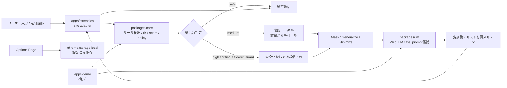

# AIまえチェック

**AIに送る前に、消し忘れを見つける。**

「AIまえチェック」は、ChatGPT / Claude / Gemini などのLLMサービスへ文章を送る前に、個人情報・秘密情報・APIキー・社外秘っぽい内容をブラウザ内で検出し、安全化を促すChrome拡張です。

単なるAIチャットではなく、普段使っているLLMの入力欄の前に置く「送信前DLPレイヤー」を目指しています。サイドパネルや独自入力欄を主役にせず、対象サイトの通常入力体験をできるだけ保ったまま、送信前に小さく止まって確認できる設計です。

## 現在の位置づけ

このリポジトリには、すでに以下の基盤があります。

- pnpm workspaceによるmonorepo構成
- `packages/core` のルールベース検出・マスキング
- `packages/llm` のWebLLM文脈チェック基盤
- `apps/extension` のChrome拡張
- `apps/demo` のLP兼デモサイト
- Vitest / Playwrightのテスト基盤

現在は、初期実装の「貼り付け時チェック」に加えて、送信ボタン・Enter送信を捕捉する「送信前DLPレイヤー」の基礎実装まで進んでいます。実装ロードマップは [DLP Roadmap Implementation Plan](./docs/superpowers/plans/2026-06-16-dlp-roadmap.md) に整理しています。

## 作った理由

生成AIに文章を送る作業は、メール作成、議事録整理、要約、翻訳、調査、コード相談などの日常業務に入り込んでいます。一方で、送ろうとしている文章には、メールアドレス、電話番号、APIキー、社内URL、顧客名、契約金額、採用・法務・給与などの注意情報が混ざりがちです。

「送信」ボタンを押す直前まで気づきにくい消し忘れを、ブラウザ内で補助的に見つける。それがAIまえチェックの目的です。

## 解決したい課題

- LLMへ送る文章に個人情報や秘密情報が混ざる
- APIキーやトークンは一度漏れると影響が大きい
- 「社外秘」と明記されていない文脈リスクは正規表現だけでは拾いにくい
- 自前サーバーや外部LLM APIへ本文を送る設計にすると、確認ツール自体が新しいリスクになる
- 個人開発でも継続できる、ランニングコストの低い構成にしたい

## ChatGPTの下位互換ではありません

AIまえチェックは文章を生成するAIチャットではありません。

ChatGPT / Claude / Gemini へ送る前に、送信内容を検出・安全化するための補助レイヤーです。最終的に送るかどうかはユーザーが判断します。AIまえチェックは「完全に安全」と断言せず、消し忘れに気づくための実用的な確認体験を目指します。

## 新方針

今後の実装方針は、貼り付けイベントだけでなく、対象LLMサイトの送信操作を捕捉する形へ寄せます。

- 初期対象サイトは ChatGPT / Claude / Gemini
- Perplexityは後続adapterで対応予定
- サイドパネルや独自入力欄ではなく、通常の入力欄を使う
- 送信直前にrisk badgeと確認モーダルを出す
- `medium` は詳細確認後に許可可能
- `high` / `critical` とSecret Guard対象は、安全化なしでは送信不可
- 変換モードは `Mask` / `Generalize` / `Minimize`
- テキスト系ファイル添付前チェックはMVPとして対応

## 主な機能

現在の実装:

- メールアドレス、電話番号、JWT、AWS Access Key風文字列、GitHub token風文字列などの検出
- 秘密鍵、`.env`形式の秘密情報、Basic認証URL、クレジットカード風番号の検出
- URL、IPv4、金額、社外秘・注意語、社内URL風文字列の検出
- 日付、郵便番号、長いID風文字列の低リスク検出
- 重複範囲を整理したマスキング
- WebLLMによるブラウザ内の文脈リスク候補チェック
- LP兼デモサイトでの検出・マスキング体験
- Chrome拡張のOptions Page

新方針で追加・刷新する機能:

- ChatGPT / Claude / Gemini のsite adapter
- 送信ボタンclick、Enter、Cmd+Enter / Ctrl+Enterの送信前インターセプト
- 小さなrisk badge
- Secret Guard
- risk score / policy判定
- カテゴリ単位の確認モーダル
- `Mask` / `Generalize` / `Minimize` の変換モード
- WebLLMによる `safe_prompt` 生成
- 変換後テキストの再スキャン
- `.txt` / `.md` / `.csv` / `.json` / `.yaml` / `.env` / `.log` / code系ファイルの添付前チェック

## 使用イメージ

1. ユーザーはChatGPT / Claude / Geminiの通常入力欄に文章を入力する
2. AIまえチェックがブラウザ内で軽量検出し、risk badgeを更新する
3. ユーザーが送信ボタンやEnterで送信しようとする
4. リスクがなければ通常どおり送信する
5. 注意情報がある場合は送信前に確認モーダルを表示する
6. ユーザーはカテゴリごとに安全化対象を確認する
7. `Mask` / `Generalize` / `Minimize` のいずれかで安全化する
8. 安全化後のテキストを再スキャンし、Secret Guardが残っていない場合に送信する

## WebLLMを使っている理由

メールアドレスやAPIキーのような確定情報は、正規表現やルールベースで検出できます。一方で、顧客名、会社名、案件名、契約前情報、採用・給与・法務・金融などの文脈リスクは、単純な文字列パターンだけでは拾いにくいことがあります。

そこでWebLLMを使い、ユーザーのブラウザ内で補助的な文脈チェックと安全化候補の生成を行います。外部LLM APIは使いません。

## WebLLMでやっていること

- 正規表現では拾いにくい文脈リスクの候補検出
- 顧客名、人名、会社名、案件名、プロジェクト名候補の検出
- 契約、見積、給与、採用、法務、金融などのセンシティブ文脈の候補検出
- 候補理由の日本語説明
- `Generalize` 用の抽象化候補
- `Minimize` 用の `safe_prompt` 生成

## WebLLMでやっていないこと

- メールアドレス検出の主役にすること
- APIキー検出の主役にすること
- 電話番号検出の主役にすること
- 最終的な安全判定を断言すること
- 文章全体の要約を主目的にすること
- 外部LLM APIへ本文を送ること

## 技術スタック

- pnpm workspace
- TypeScript
- React
- WXT
- Vite
- Tailwind CSS
- Vitest
- Playwright
- Chrome Extension Manifest V3
- `@mlc-ai/web-llm`
- Web Worker
- WebGPU
- `chrome.storage.local`

## アーキテクチャ図



## ディレクトリ構成

```text
repository-root/
  apps/
    extension/  Chrome拡張本体
    demo/       LP兼Webデモサイト
  packages/
    core/       ルールベース検出、マスキング、型定義
    llm/        WebLLM文脈チェック、Worker、プロンプト、JSONパース
  docs/
    superpowers/plans/  実装計画
  AGENTS.md
  README.md
  package.json
  pnpm-workspace.yaml
```

## セットアップ

```bash
pnpm install
```

PlaywrightのE2Eを実行する場合:

```bash
pnpm exec playwright install chromium
```

## 開発コマンド

```bash
pnpm dev
pnpm dev:extension
pnpm dev:demo
pnpm build
pnpm build:extension
pnpm build:demo
pnpm test
pnpm test:core
pnpm test:llm
pnpm test:e2e
pnpm lint
pnpm typecheck
```

`pnpm lint` は現時点では `pnpm typecheck` の別名です。

## Chrome拡張の読み込み方法

1. `pnpm build:extension` を実行する
2. Chromeで `chrome://extensions` を開く
3. デベロッパーモードを有効にする
4. 「パッケージ化されていない拡張機能を読み込む」を選ぶ
5. `apps/extension/.output/chrome-mv3` を選択する

## デモサイトの起動方法

```bash
pnpm dev:demo
```

起動後、表示されたローカルURLをブラウザで開きます。

## 検出対象

高リスク:

- メールアドレス
- 日本の電話番号
- JWT
- AWS Access Key風文字列
- GitHub token風文字列
- 秘密鍵
- `.env`形式の秘密情報
- Basic認証情報を含むURL
- クレジットカード風番号

中リスク:

- URL
- IPv4アドレス
- 金額
- 社外秘・注意語を含む文
- 社内URLっぽいもの

低リスク:

- 日付
- 郵便番号
- 長いID風文字列

新方針では、これらに加えてSecret Guard対象を明確化します。Secret Guard対象には、APIキー、private key、SSH/PEM秘密鍵、JWT、`.env`、DATABASE_URL、AWS/GitHub/Slack/Stripe/OAuth token、webhook URL、クレジットカード風番号、マイナンバー風文字列などを含める予定です。

テキスト系ファイル添付前チェックのMVPでは、`.txt`, `.md`, `.csv`, `.json`, `.yaml`, `.yml`, `.env`, `.log`, `.js`, `.ts`, `.py`, `.go`, `.rb`, `.java`, `.html`, `.xml` をローカルで読み取り、同じルールベース検出とrisk scoreを適用します。PDF / docx / xlsx / 画像OCRは対象外です。

## プライバシー設計

- 貼り付け本文や送信本文を永続保存しません
- 検出結果を永続保存しません
- placeholderMapを永続保存しません
- 送信履歴を保存しません
- ファイル本文を保存しません
- 設定のみ `chrome.storage.local` に保存します
- ユーザー本文を `console.log` で出力しません
- エラーにも本文を含めません
- Analyticsやトラッキングを入れません
- 外部LLM APIへ本文を送りません

WebLLMを使う場合、検出とAI文脈チェックはユーザーのブラウザ内で実行されます。自前の推論サーバーやOpenAI API / Claude API / Gemini APIなどは利用しません。

## モデルファイル取得に関する説明

WebLLMの初回利用時には、ローカル推論用のモデルファイルを取得する場合があります。モデル取得後はブラウザキャッシュやブラウザ管理下の保存領域を利用します。

貼り付け本文や送信本文は外部サーバーに送信されません。ただし、WebLLMのモデル配信元、ブラウザ実装、キャッシュやIndexedDBなどの保存領域には依存します。private browser / シークレットモードでは保存容量が制限され、`QuotaExceededError` などでAI文脈チェックを利用できない場合があります。

## セキュリティ上の注意

- 本ツールは情報漏洩を完全に防ぐものではありません
- 検出漏れや誤検出が発生する可能性があります
- 最終的に送信するかどうかはユーザーが判断してください
- WebLLMによる判定は補助的な候補提示です
- WebGPU非対応環境ではAI文脈チェックを利用できない場合があります
- モデルロードには時間がかかる場合があります
- 対象サイトのDOM変更によりadapterが動かなくなる可能性があります
- 通常入力欄を使う設計のため、送信前に対象ページ側のJavaScriptや他の拡張機能が入力欄の文字列へアクセスできる可能性は残ります

## 実装上の前提・制限

- 初期対象サイトは ChatGPT / Claude / Gemini です
- Perplexityは後続adapterとして扱います
- 初期実装では `<all_urls>` を無条件に要求しません
- 対象サイトごとのDOM構造に依存するため、継続的なadapter保守が必要です
- `medium` は詳細確認後に許可可能です
- `high` / `critical` とSecret Guard対象は、安全化なしでは送信不可にします
- WebLLMが失敗しても、ルールベース検出は引き続き利用できます
- WebLLMの実モデルロードはテストの必須条件にしません
- LLM候補は確定扱いせず、ユーザーが確認する候補として扱います
- 同じsurfaceが複数回出る場合、初期実装では出現箇所ごとにFinding化します
- ファイル添付前チェックはテキスト系ファイルのみが対象です。PDF / docx / xlsx / 画像OCRはMVPでは解析しません
- ファイル本文は読み取り後のメモリ上でのみ扱い、永続保存やログ出力はしません
- 商用利用を意識した構成ですが、利用するWebLLMモデルごとのライセンスや配信条件は個別確認が必要です
- 自前サーバーや外部API利用料は発生しない設計ですが、第三者のモデル配信元やブラウザ機能には依存します

## GitHubでの開発運用

このリポジトリはpublic前提で管理します。Issue / PR / README / テストデータには、実在の個人情報、実APIキー、実トークンを入れません。

基本の流れ:

1. 作業内容をIssueにする
2. Issue番号に紐づくブランチを作る
3. 実装、テスト、ビルドを行う
4. PRを作成する
5. 確認後にマージする

今回の方針転換は次のIssueに分割しています。

- #17 方針転換ロードマップ
- #18 core: risk score / policy / transform model
- #19 extension: site adapter / send interception
- #20 extension: paste guard / risk badge
- #21 extension: category confirmation modal
- #22 llm: WebLLM Generalize / Minimize / safe_prompt
- #23 extension: text file preflight
- #24 demo/docs: LP兼デモとREADME更新

## 今後追加したい機能

- ChatGPT adapterの安定化
- Claude / Gemini adapterの実地検証
- Perplexity adapter
- Secret Guardの強化
- PDF / docx / xlsx / 画像OCRなど、非テキストファイルの安全な検査方法
- WebLLMモデル選択UIの改善
- Chrome Web Store公開用のアイコンとスクリーンショット整備
- GitHub ActionsによるCI

## スクリーンショット掲載予定

- LP兼デモサイト
- Chrome拡張のrisk badge
- 送信前確認モーダル
- Options Page
- AI文脈チェック結果
