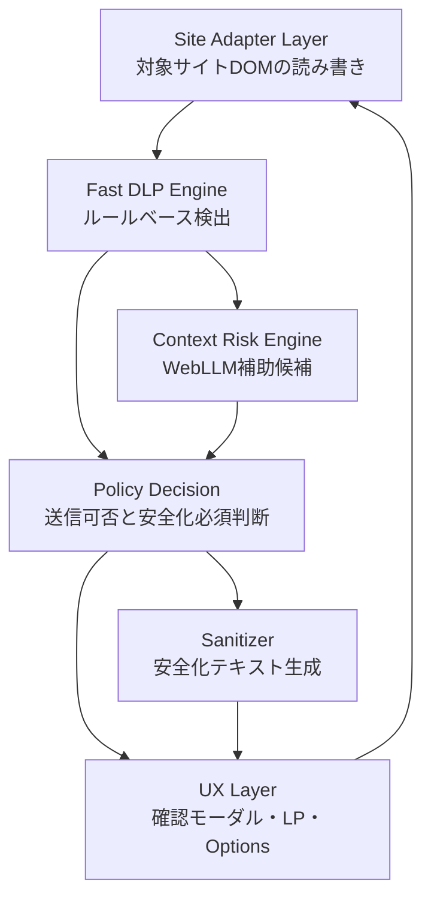

# ローカルDLPランタイム設計

最終更新日: 2026-06-23

AIまえチェックは、単に「WebLLM付きのChrome拡張」ではなく、ブラウザ内で完結する送信前DLPランタイムとして育てていきます。この文書は、各レイヤーの責務、既存実装との対応、後続Issueへの分割方針をまとめるものです。

0.1.0のChrome Web Store公開ZIPには影響させず、0.1.1以降または0.2系の設計改善として段階的に反映します。

## 基本方針

- ルールベース検出を安全判定の主役にする。
- WebLLMは、正規表現だけでは拾いにくい文脈上の注意候補を出す補助機能に限定する。
- WebLLMに最終的な安全判定、送信可否、完全な安全宣言をさせない。
- 高リスク、秘密情報保護の対象、送信不可判断は Fast DLP Engine と Policy Decision で扱う。
- ユーザー本文を外部LLM API、開発者サーバー、ルール配信Workerへ送らない。
- ユーザー本文、検出結果、placeholderMap、送信履歴を永続保存しない。
- モーダル表示や送信前の一次判断は、WebLLMのモデルロードや推論完了を待たない。

## レイヤー構成

## 各レイヤーの責務

### 1. Site Adapter Layer

対象サイトごとの差分を吸収する層です。

責務:

- ChatGPT / Claude / Gemini / Perplexity の入力欄を見つける。
- 対象サイトの送信ボタンと送信キー操作を判定する。
- 現在の下書き本文を読み取る。
- 安全化後テキストを通常入力欄へ戻す。
- React系UIに変更が伝わるように入力イベントを発火する。

やらないこと:

- DLP判定そのもの。
- WebLLM文脈チェック。
- 送信可否の最終判断。
- ユーザー本文の保存やログ出力。

現在の実装:

- `apps/extension/src/content/adapters/baseAdapter.ts`
- `apps/extension/src/content/adapters/chatgptAdapter.ts`
- `apps/extension/src/content/adapters/claudeAdapter.ts`
- `apps/extension/src/content/adapters/geminiAdapter.ts`
- `apps/extension/src/content/dom/sendInterceptor.ts`
- `docs/site-adapter-contract.md`

### 2. Fast DLP Engine

貼り付け前・送信前に即時実行する主判定エンジンです。メールアドレス、電話番号、APIキー風文字列、JWT、秘密鍵、`.env` 形式の秘密情報、Basic認証URL、金額、注意語など、ルールで検出できるものを担当します。

責務:

- ブラウザ内で同期的にルールベース検出を実行する。
- Finding、riskLevel、DLPカテゴリ、placeholderを返す。
- 重複範囲の正規化や優先順位処理を行う。
- 署名検証済みの追加ルールを同梱ルールへ安全に合流する。

やらないこと:

- 送信ボタンや入力欄のDOM操作。
- WebLLMへの問い合わせ。
- ユーザーへの表示文言の最終組み立て。

現在の実装:

- `packages/core/src/detect.ts`
- `packages/core/src/mask.ts`
- `packages/core/src/transform.ts`
- `packages/core/src/remoteRules.ts`
- `fixtures/dlp/*.json`
- `scripts/eval-dlp.test.ts`
- `docs/detection-rule-authoring.md`
- `docs/dlp-evaluation.md`

### 3. Policy Decision

検出結果をもとに、ユーザー操作をどう扱うか決める層です。UIごとに判断が散らばると、デモ、貼り付け時、送信前、ファイル確認で基準がずれるため、最終的には `packages/core` に集約します。

責務:

- `allow`、`confirm`、`sanitize_required` を決める。完全な遮断が必要なケースは、将来のポリシー拡張として別途設計する。
- 高リスク、critical、秘密情報保護の対象が残っている場合に安全化必須とする。
- 中リスクは詳細確認後にユーザー判断可能として扱う。
- WebLLM候補を補助情報として扱い、主判定をルールベースから外さない。

やらないこと:

- 検出ルールの実行。
- UIのDOM描画。
- WebLLMのプロンプト生成。

現在の実装:

- `packages/core/src/policy.ts`
- `apps/extension/src/content/dom/pasteGuard.ts`
- `apps/extension/src/content/contentReview.ts`

現在の `evaluateDlpPolicy` は、互換性のため `DlpPolicyDecision` に `canSendRaw` と `requiresSanitization` を残しつつ、完全な戻り値型 `PolicyDecision` として `action`、`severity`、`reason`、`requiredFindingIds`、`optionalFindingIds` を返します。UIはこの結果を表示とボタン状態に使い、独自の送信可否ロジックを持たない方向へ寄せます。

後続:

- Policy Decisionの判定を追加する場合は、まず `packages/core/src/policy.ts` と `packages/core/tests/policy.test.ts` に寄せる。

### 4. Context Risk Engine

WebLLMとローカル補助候補により、ルールだけでは拾いにくい文脈上の注意候補を出す層です。

責務:

- 顧客名候補、人名候補、会社名候補、案件名候補を補助的に提示する。
- 契約、採用、給与、法務、社外秘に近い文脈を補助候補として提示する。
- ルール検出結果や文脈ヒントをもとに `ContextHintResult` を返し、AI文脈チェックを提案する理由をテスト可能にする。
- WebLLMへ渡す本文は `ContextBuilder` で短いwindowに絞り、全文を前提にしない。
- Chrome拡張MV3では常時待機できないため、WebLLMがbridge内で準備済みの場合だけ自動実行し、未準備時は手動ボタンを残す。
- WebGPU非対応、モデル取得失敗、JSONパース失敗でもFast DLP Engineを止めない。
- WebLLMの結果を「候補」として返す。

やらないこと:

- メールアドレス、電話番号、APIキー検出の主役になること。
- 送信可否を断言すること。
- 安全化対象をユーザー確認なしで確定すること。
- 外部LLM APIへ本文を送ること。

現在の実装:

- `packages/llm/src/analyzer.ts`
- `packages/llm/src/runtimeService.ts`
- `packages/llm/src/contextBuilder.ts`
- `packages/llm/src/prompt.ts`
- `packages/llm/src/parser.ts`
- `packages/llm/src/convert.ts`
- `apps/extension/src/lib/reviewLlmRunner.ts`
- `apps/extension/src/lib/llmBridgeClient.ts`
- `apps/extension/src/llmBridgePage.ts`
- `docs/webllm-model-policy.md`
- `docs/webllm-error-recovery.md`

実装済みの分離:

- #293でWebLLM実行状態を `LocalLlmRuntimeService` としてUIから分離し、UIは `status()` と `analyze()` の結果を受け取る構造へ寄せています。
- `prepare()` は本文を受け取らず、モデル準備だけを扱います。
- `error` 状態には日本語メッセージと復旧ヒントを持たせ、ユーザー本文は含めません。

### 5. Sanitizer

検出結果とPolicy Decisionをもとに、安全化後テキストを作る層です。

責務:

- 選択されたFindingだけを安全化対象にする。
- 後ろから置換してindexずれを避ける。
- ユーザー向けには日本語ラベルによる安全化結果を返す。
- placeholderMapを永続保存しない。

やらないこと:

- 送信可否の判断。
- WebLLM推論。
- 対象サイトへの挿入。

現在の実装:

- `packages/core/src/transform.ts`
- `packages/core/src/mask.ts`
- `apps/extension/src/lib/pasteReviewTextTransform.ts`
- `apps/extension/src/lib/reviewSelection.ts`
- `apps/demo/src/lib/demoMasking.ts`
- `docs/sanitization-concepts.md`

### 6. UX Layer

ユーザーに判断材料と選択肢を出す層です。Chrome拡張の確認モーダル、Options Page、紹介LP、ミニデモが含まれます。

責務:

- 高リスク、中リスク、低リスク、秘密情報保護の対象を分かりやすく表示する。
- 安全化対象をユーザーが確認・変更できるようにする。
- WebLLMの状態を「補助候補」として表示する。
- WebGPU非対応やモデル取得失敗時に、日本語で復旧可能な説明を出す。
- 「完全に安全」「100%検出」などの誇大表現を避ける。

やらないこと:

- 独自の送信可否ロジックを持つこと。
- 本文や検出結果を保存・ログ出力すること。
- WebLLM候補を確定判定として扱うこと。

現在の実装:

- `apps/extension/src/lib/modal.ts`
- `apps/extension/src/lib/reviewListRenderers.ts`
- `apps/extension/entrypoints/options/OptionsApp.tsx`
- `apps/demo/src/components/*`
- `docs/chrome-web-store-submission-copy.md`

## 既存実装との対応表

| レイヤー | 現在の主な場所 | 今後の整理 |
| --- | --- | --- |
| Site Adapter Layer | `apps/extension/src/content/adapters/*` | 対象サイト追加時もadapter単位で閉じる |
| Fast DLP Engine | `packages/core/src/detect.ts`, `remoteRules.ts`, `detectors/*` | カテゴリ別detectorsへ段階分割済み。今後は配信ルールと評価fixtureを増やす |
| Policy Decision | `packages/core/src/policy.ts`, `pasteGuard.ts`, `contentReview.ts` | 判定責務はcoreへ集約済み。今後は運用ルール追加時にpolicyテストを増やす |
| Context Risk Engine | `packages/llm/src/*`, `reviewLlmRunner.ts`, LLM bridge | ContextBuilder、準備済み時自動実行、LocalLlmRuntimeServiceを実装済み |
| Sanitizer | `packages/core/src/transform.ts`, `mask.ts` | #392でredact / placeholderなど内部変換モードを整理する |
| UX Layer | 拡張モーダル、Options Page、LP/デモ | #393でモーダルCSS重複を減らし、#388で拡張E2Eを追加する |

## 処理フロー

### 貼り付け時

1. Content Scriptがpasteイベントを検知する。
2. Site Adapterまたは共通DOM処理が対象入力欄か確認する。
3. Fast DLP Engineが本文を検出する。
4. Policy Decisionが `allow` / `confirm` / `sanitize_required` を決める。
5. `allow` なら通常貼り付けを続ける。
6. `confirm` または `sanitize_required` なら確認モーダルを表示する。
7. ユーザーが安全化対象を確認し、Sanitizerが安全化後テキストを作る。
8. Site Adapterまたは共通挿入処理が入力欄へ反映する。

### 送信前

1. Site Adapterが送信ボタンまたは送信キー操作を捕捉する。
2. 現在の入力欄テキストを読み取る。
3. Fast DLP EngineとPolicy Decisionを実行する。
4. 高リスクや秘密情報保護の対象がある場合、安全化なしでは送信しない。
5. 中リスクは詳細確認後にユーザー判断で続行できる。
6. WebLLMは必要に応じて追加候補を提示するが、送信可否の主判定にはしない。

## 関連Issueへの分割方針

| Issue | 状態 | 位置づけ |
| --- | --- | --- |
| #290 | 実装済み | ContextHintResultとContextBuilderでWebLLM入力を短縮する |
| #291 | 実装済み | WebLLM準備済み時だけAI文脈チェックを自動実行する |
| #292 | 実装済み | DLP評価fixtureとevalコマンドを追加する |
| #293 | 実装済み | LocalLlmRuntimeServiceでWebLLM実行状態をUIから分離する |
| #294 | 実装済み | 検出ルールをカテゴリ別detectorsへ段階的に分割する |
| #295 | 実装済み | PolicyDecisionを独立した判定エンジンとして整理する |
| #334 | 実装済み | 拡張モーダルをプロダクトUIとして再設計する |
| #386 | 対応中 | Chrome Web Store 0.1.1を再提出し公開後導線を更新する |
| #388 | 対応中 | Chrome拡張E2Eハーネスを実装してローカル模擬composerでpaste/submitを検証する |
| #390 | 実装済み | 署名付きルール配信の複数鍵ローテーションに対応する |
| #391 | 実装済み | 検証済みリモートルールの短期キャッシュとTTLを実装する |
| #392 | 対応中 | 安全化の内部変換モードをredact / placeholder単位で整理する |
| #393 | 対応中 | 拡張モーダルのCSS定義を共通化して重複を減らす |

## 関連ドキュメント

- [脅威モデル](./threat-model.md)
- [SiteAdapter契約とE2E確認項目](./site-adapter-contract.md)
- [ローカルDLPランタイム性能基準](./performance-budget.md)
- [安全化・マスク・秘密情報保護の整理](./sanitization-concepts.md)
- [検出ルール作成ガイド](./detection-rule-authoring.md)
- [DLP評価fixture](./dlp-evaluation.md)
- [WebLLMモデル選定とライセンス確認](./webllm-model-policy.md)
