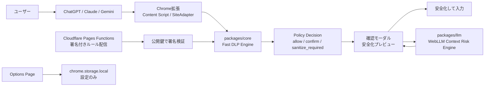
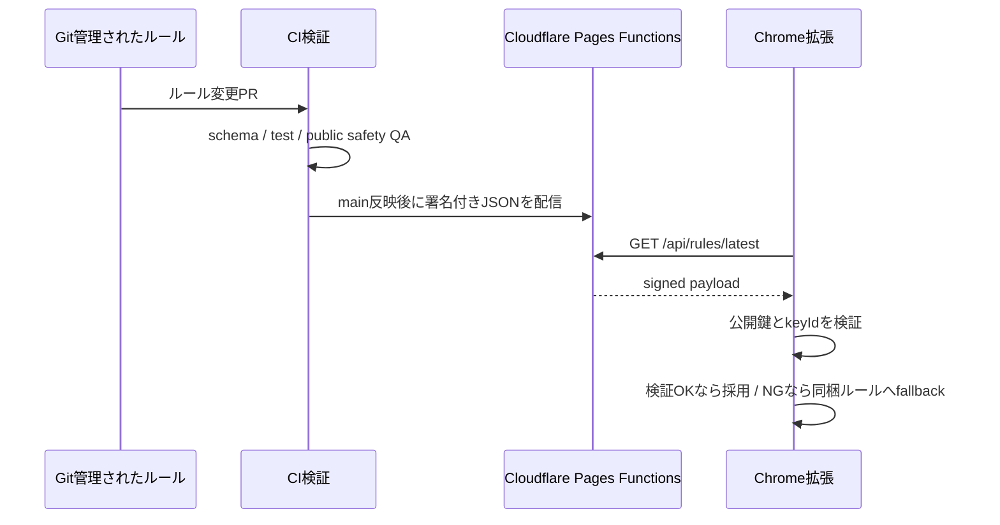

# AIまえチェック ケーススタディ

AIまえチェックは、ChatGPT / Claude / Geminiへ文章を貼り付ける前・送信する前に、個人情報・秘密情報・APIキーなどの消し忘れに気づくためのChrome拡張です。紹介LPとミニデモはありますが、Chrome拡張が本体です。

## 作った理由

生成AIは日常業務に入り込みました。議事録、メール、問い合わせ文、コード相談、契約前のメモなどをAIへ送る場面は増えています。一方で、送る直前の文章には、メールアドレス、電話番号、APIキー、社内URL、顧客名、契約金額、採用や給与に関する文脈が混ざることがあります。

AIまえチェックは、AIチャットそのものを置き換えるものではありません。AIに貼る前・送る前の最後の確認レイヤーとして、ユーザーが消し忘れに気づくための補助ツールです。

## 解決したい課題

- 送信直前まで気づきにくい個人情報・秘密情報の混入
- 正規表現で拾える確定情報と、文脈で見ないと分からない注意候補の混在
- 外部LLM APIや自前サーバーへ本文を送る確認ツールへの抵抗感
- Chrome拡張として対象サイト上で自然に止まるUX
- 無料で運用でき、ポートフォリオとして設計判断が説明できる構成

## 設計判断

### 1. Chrome拡張を本体にする

LP上のミニデモではなく、実際にChatGPT / Claude / Geminiの入力欄で貼り付け・送信前に確認することを主価値にしました。ユーザーが文章を送る直前の場所で止まるためです。

### 2. ルールベース検出を主役にする

メールアドレス、電話番号、JWT、AWS Access Key風文字列、GitHub / Slack / Stripe / OpenAI / npm / OAuth token風文字列、秘密鍵、`.env`形式の秘密情報、Basic認証URL、Webhook URL、DATABASE_URL風接続文字列、クレジットカード風番号、マイナンバー風文字列などは、WebLLMではなく `packages/core` のルールベース検出で扱います。

高リスク情報や秘密情報保護対象は、WebLLMの判断を待たずに安全側へ倒します。これは速度と説明可能性を優先した判断です。

### 3. WebLLMは補助的な候補提示に限定する

WebLLMは、顧客名、会社名、案件名、契約・採用・給与・法務など、正規表現だけでは拾いにくい文脈上の注意候補を見つけるために使います。WebLLMの結果は「確定」ではなく「候補」として表示し、ユーザーが安全化対象に含めるか確認します。

### 4. 本文を保存しない

貼り付け本文、送信本文、検出結果、placeholderMap、送信履歴は永続保存しません。保存するのは `chrome.storage.local` 上の設定だけです。ルール配信を使う場合も、拡張が送るのは署名付きルールJSONを取得する `GET /api/rules/latest` だけで、本文は送りません。

### 5. 署名付きルール配信を後続拡張として設計する

ルールはGit管理し、CIで検証し、Cloudflare Pages Functions / Workersから署名付きJSONとして配信する方針です。拡張側は公開鍵で署名を検証し、検証できないルールは採用しません。これにより、拡張を毎回更新しなくても検出ルールを増やしつつ、改ざんや誤配信に対して安全側へ倒せます。

## アーキテクチャ

## 技術スタック

- TypeScript
- React
- WXT
- Vite
- Tailwind CSS
- Vitest
- Playwright
- Chrome Extension Manifest V3
- WebLLM / WebGPU / Web Worker
- Cloudflare Pages / Pages Functions
- pnpm workspace

## ルール配信と署名検証

0.1.1では、ルール配信用の鍵ペアを再発行し、Cloudflare側のSecretと拡張側の公開鍵を一致させています。本番APIの署名は `pnpm qa:rules:production` で検証できます。署名検証に失敗した場合や、ネットワークエラーが起きた場合は、同梱ルールだけで動作します。

## プライバシーとセキュリティ

- 本文を永続保存しない
- 検出結果やplaceholderMapを保存しない
- 外部LLM APIへ本文を送らない
- Analyticsやトラッキングを入れない
- `chrome.storage.local` は設定保存に限定する
- GitHub Issue / PR / README / テストデータに実データを入れない
- WebLLMモデル取得時には通信が発生する場合があることを明記する

## 制限

AIまえチェックは情報漏洩を完全に防ぐものではありません。検出漏れや誤検出は発生し得ます。WebLLMによる文脈チェックは補助的な候補提示であり、最終的な送信判断はユーザーが行います。

また、WebGPU非対応環境ではAI文脈チェックが使えない場合があります。その場合も、ルールベース検出は引き続き利用できます。

## ポートフォリオとして見てほしい点

- Chrome拡張の実サイト介入とReact系入力欄への挿入処理
- UIではなく `packages/core` に検出エンジンを分離したこと
- WebLLMを安全判定の中心に置かず、補助候補として扱ったこと
- 本文を保存しないプライバシー設計
- Cloudflareを使った無料運用と署名付きルール配信の拡張余地
- Chrome Web Store公開、掲載素材、プライバシーポリシー、サポート導線、QAコマンドまで整えたこと

## 今後

- 0.1.1 ZIP再生成とChrome Web Store再提出
- Policy Decisionの独立
- ContextBuilderによるWebLLM入力短縮
- 評価fixtureと `eval:dlp`
- Perplexity adapter
- 非テキストファイル検査のロードマップ整理
